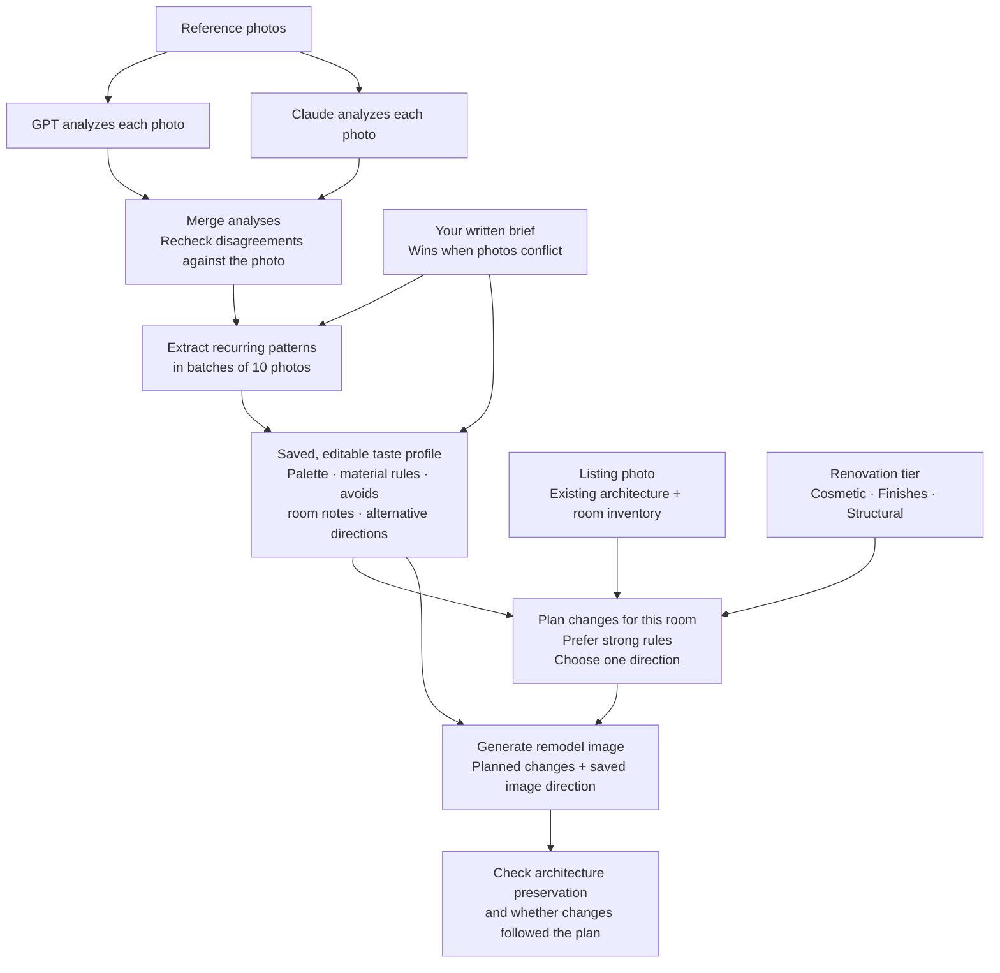

# Remodel Lens

Remodel Lens creates realistic listing-photo redesigns from your interior-taste
references. Each redesign is scoped to a budget tier and includes a report with
cost bands and checks for changes to fixed architecture. See [PLAN.md](PLAN.md)
for architecture and roadmap details.

## Get started

### Requirements

- Node.js 22 or newer and npm.
- API keys for OpenAI and Anthropic to use the default models. Image generation
  always uses OpenAI. You can start the local app without keys, but you need
  the required keys to rebuild taste rules or generate redesigns.

### Install and configure

From the repository root:

```bash
npm ci
npm run app
```

Open <http://localhost:4310> and choose **Settings** (bottom of the sidebar, or
the last tab on a phone). There you can:

- **API keys:** paste your OpenAI and Anthropic keys and check that each one
  works. Once saved, only the last four characters are shown.
- **Models:** pick the reasoning model, the reference analysis models, and the
  image model.
- **Tuning:** set the edge-check threshold, score your past runs (no API
  calls), label images where the structure changed, and apply the suggested
  threshold.
- **Cost assumptions:** change the local labor factors, finish-grade
  multipliers, overhead, and any unit cost in the pricing table.

Settings are saved in `.settings.json` at the repository root, which git
ignores and only your user can read. They apply to the command-line tools too,
and they win over `.env.local`. Clearing a setting falls back to `.env.local`.

If you prefer files, copy `.env.example` to `.env.local` and add your keys:

```dotenv
OPENAI_API_KEY=your-openai-key
ANTHROPIC_API_KEY=your-anthropic-key
```

The defaults use OpenAI and Anthropic for reference analysis, OpenAI for
planning and checks, and OpenAI for image edits. To use OpenAI for all analysis
and planning, set these optional overrides in `.env.local`:

```dotenv
ANALYSIS_MODELS=openai/gpt-6.1-sol
REASONING_MODEL=openai/gpt-6.1-sol
```

You can change model IDs and image concurrency with the optional settings in
[`.env.example`](.env.example). Keep real keys in `.env.local`; never commit
them.

### Start the app

```bash
npm run app
```

Open <http://localhost:4310>. To use another local port, set `PORT` before
starting the app, for example `PORT=4320 npm run app`.

## Create a taste profile

1. In **Taste profiles**, open **Example** or choose **New** to create a profile.
2. Add at least 3 interior reference photos you like; 10–20 gives the models
   more to work with. JPG, PNG, WebP, and TIFF are supported. Near-duplicates
   are skipped.
3. Write a brief describing your preferred styles, materials, colors, rooms,
   and things to avoid. Be specific about the materials and details you want.
4. Choose **Rebuild rules**. The app combines the brief with analysis of your
   references. You can then edit the rules, image direction, and room notes in
   the app.

The app saves the profile in `profiles/<id>/`. You can rebuild its rules from
the command line with:

```bash
npm run taste -- --profile example
```

### How the taste pipeline works

A rebuild turns reference photos and your written brief into a saved, editable
profile. Redesigns apply that profile to each room within the chosen renovation
tier. The diagram shows the default two-model analysis; `ANALYSIS_MODELS` can
configure a different set, including a single model that skips the merge step.



Each rule records how many distinct reference photos support it and whether
your brief states it. A rule is **strong** when it comes from the brief, or when
at least 25% of the photos support it, rounded up, with a minimum of two photos.
For 20 references, a rule seen in 5 photos is strong; a rule seen in 1 photo is
weak; a rule stated in the brief is strong even with no photo evidence. These
counts are model-derived evidence, not measured confidence. Planning prefers
strong rules and uses weak rules only where no strong rule applies.

The profile also captures room-specific notes and, when supported, alternative
directions such as earthy or playful. Planning chooses one direction per room
and adapts it to the existing architecture and allowed work. Image generation
receives the listing photo, planned changes, and saved image direction and
room notes; it does not receive the taste reference photos directly.

Changing references or the brief marks the profile as out of date; **Rebuild
rules** updates it. You can also edit and save the rules directly. A rebuild
replaces those edits but keeps the previous profile available to restore.
Keep category rules, image direction, and room notes consistent because they
guide different stages of the redesign.

Implementation: [taste pipeline](src/taste/pipeline.ts),
[taste prompts](src/taste/prompts.ts), [redesign planning](src/redesign/plan.ts),
and [image generation](src/redesign/generate.ts).

## Add a listing

Import photos from a local folder. Replace the example path, ID, and name with
your own:

```bash
npm run import -- ~/Pictures/123-main-st --id 123-main-st --name "123 Main St"
```

The importer accepts JPG, PNG, WebP, and TIFF files, corrects photo rotation,
resizes large images, skips near-duplicates, and adds new photos as selected.
Reload the app to see the listing. You can also import individual files by
passing their paths instead of a folder. In the app, label rooms (for example,
`kitchen` or `den`), choose which photos to redesign, select a taste profile,
and choose the budget tiers.

Listings and their selections are stored in `listings/<id>/`. To add more
photos to an existing listing, run the import command again with the same ID.

## Generate a redesign

In the app, open the listing and choose **Run redesign**. The report opens when
the run finishes. Each room includes before-and-after images by tier, a change
list with cost bands, and a verification status.

To share a report with someone who won't open the app, use **Summary PDF** or
**Full scope PDF** at the upper right of the report. Both are landscape, so each
listing photo and its redesign sit side by side at a readable size. **Summary**
(about four pages) has the whole-listing estimate per scope, a before-and-after
for every room, the largest costs, and what to check. **Full scope** adds every
scope of every room with both photos large, what to check, and every planned
change with what it replaces and how it was priced.

You can also run the saved listing selection from the CLI:

```bash
npm run redesign -- listings/123-main-st --profile profiles/example/profile.json --tiers cosmetic,moderate
```

Add `major` to `--tiers` for speculative layout changes. Reports and run data
are saved under `.runs/`. API calls can incur charges; each run processes the
selected photos across the chosen tiers, and rebuilding a profile analyzes its
reference photos.

| Status | Meaning |
|---|---|
| Verified | Fixed elements (windows, doors, stairs, ceiling) passed both the edge check and the vision judge. |
| Needs review | The judge passed, but an edge shifted near a fixed element or the plan was only partly followed. |
| Unverified | Verification failed twice. Architecture changed; don't rely on the image for decisions. |

## Tune verification

After a few real runs, check how well the edge check separates good images from
broken ones and how the image models compare:

```bash
npm run tune
```

This re-scores every saved image under `.runs/redesign/` without any API calls
and writes `.runs/tuning/report.md`. The report sweeps edge thresholds from
0.20 to 0.70, suggests the one with the best balance of caught failures and
false alarms, shows the correlation range per element type, and compares image
models by verdict and retry rate. Apply a suggested threshold with
`EDGE_THRESHOLD` in `.env.local`.

By default the vision judge's structural call is treated as the right answer.
Your own judgment is better. To label images yourself:

```bash
npm run tune -- labels
```

Open `.runs/tuning/labels.json`, set `label` to `"ok"` or `"broken"` for the
images you've looked at (each entry lists the original and redesign paths), and
run `npm run tune` again. Re-running `labels` adds new images and keeps your
labels.

To compare image models on the same photos, redesign one listing once per
model. This makes API calls for every model, and the CLI prints an estimate
first:

```bash
npm run tune -- compare listings/123-main-st --models gpt-image-2,gpt-image-2.5-sunburst --profile profiles/example/profile.json
```

Runs from before this change don't record their image model and show as
`unknown` in the model comparison.

## Your data and privacy

Listings, profiles, reference photos, and run artifacts are stored in this
checkout. Personal listings, profiles, and runs are gitignored; only the empty
`profiles/example/` starter profile is shared in the repository. When you
rebuild rules or generate a redesign, the relevant reference or listing photos
and prompts are sent to the configured model providers for processing. Do not
use photos or details you are not comfortable sending to those providers.
Remodel Lens does not scrape listing sites; source listing photos yourself.

## Configuration

Settings are read from `.env.local` (preferred) or `.env` in the repository
root. `.env.example` lists the defaults:

| Setting | Default | Purpose |
|---|---|---|
| `OPENAI_API_KEY` | — | Required for image edits and default OpenAI models. |
| `ANTHROPIC_API_KEY` | — | Required by the default analysis models. |
| `ANALYSIS_MODELS` | `openai/gpt-6.1-sol,anthropic/claude-sonnet-5-5` | Models that analyze each taste reference. |
| `REASONING_MODEL` | `openai/gpt-6.1-sol` | Planning, rule extraction, and verification. |
| `IMAGE_MODEL` | `gpt-image-2.5-sunburst` | Image-edit model. |
| `IMAGE_CONCURRENCY` | `6` | Maximum image edits in flight across listings (also on the Settings page). Lower it if OpenAI rate-limits. |
| `EDGE_THRESHOLD` | `0.45` | Minimum edge correlation for a fixed element to pass. See [Tune verification](#tune-verification). |
| `PORT` | `4310` | Local app port. |

## Development checks

```bash
npm run check
npm test
```
